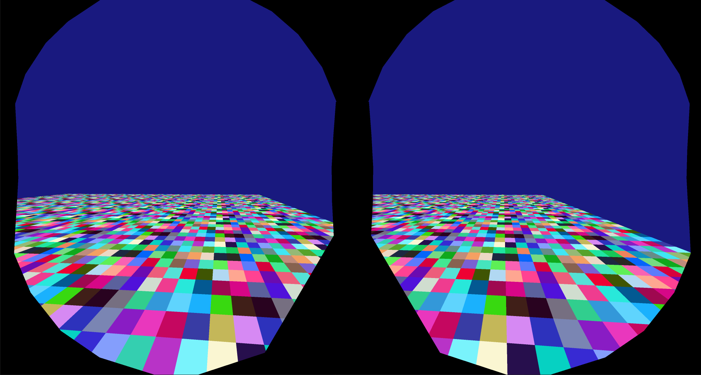

# Examples of OpenVR in C#

## Included Examples
### Basic
Minimal code to track something.

You might want to play around and see how to track different objects.

### OpenGL
Using OpenVR in OpenGL.

This example is more involved but has been written to be as readable as possible. There is also a few optional features which make it look longer than is strictly necessary but are good references - Most code is actually OpenGL related not OpenVR as OpenVRs boilerplate is so small.

## Building and Running
1. Ensure the selected build configuration is targetting the correct Platform, for example x64.
2. Build
3. [Maunally copy your respective openvr_api.dll](https://github.com/ValveSoftware/openvr/tree/master/samples/bin). I have tested with 1.16.8 but this may stop working if SteamVR updates break backwards compatibility. In that case, download the latest dll and also update [openvr_api.cs](https://github.com/ValveSoftware/openvr/tree/master/headers) in the Common project.